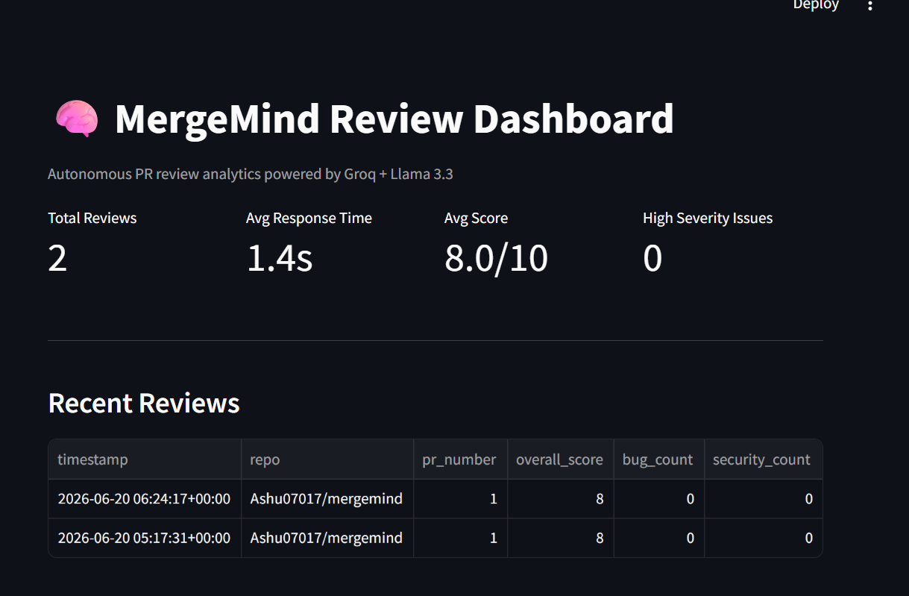
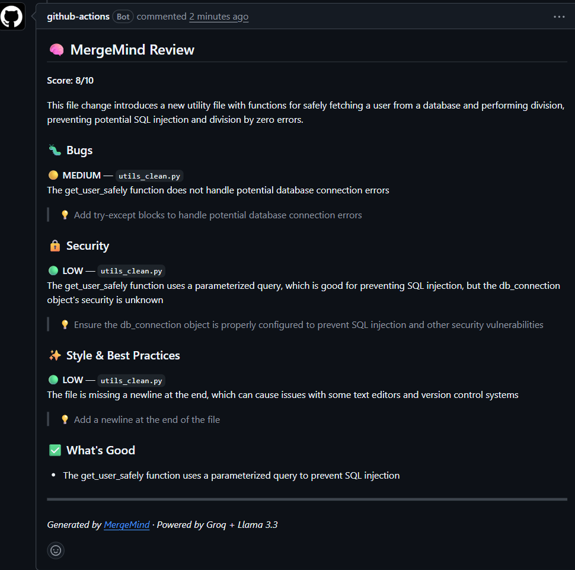
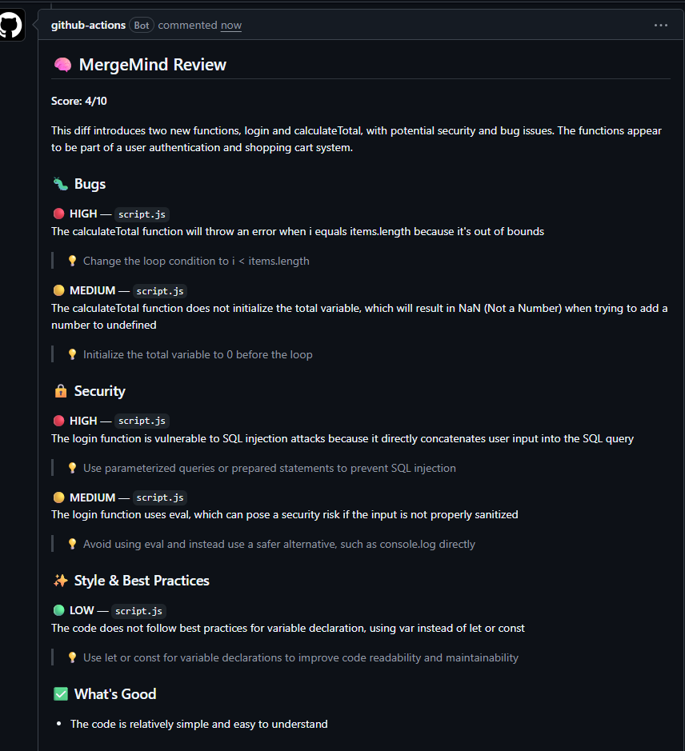

# 🧠 MergeMind

**Autonomous PR review agent** — detects bugs, security issues, and style problems in every pull request, automatically, in under 60 seconds.

[](https://github.com/Ashu07017/mergemind/actions/workflows/pr-review.yml)
[](https://www.python.org/)
[](https://groq.com/)

📦 **[Example PR Review](https://github.com/Ashu07017/mergemind/pull/2)**

---

## What it does

The moment a pull request is opened on a repo with MergeMind installed, it wakes up automatically:

1. **Fetches** the code diff via the GitHub REST API
2. **Splits** large multi-file diffs into per-file chunks (so nothing gets truncated or missed)
3. **Reviews** each chunk using an LLM (Groq + Llama 3.3 70B) for bugs, security vulnerabilities, and style issues
4. **Posts** a structured, severity-tagged markdown comment directly on the PR
5. **Logs** every review to `reviews.json` for a persistent audit trail

No human has to trigger it. No behavior change required from the team — just drop in one workflow file.


*MergeMind reviewing [PR #3](https://github.com/Ashu07017/mergemind/pull/3) — autonomous review with bug detection, security scanning, and actionable code insights.*


*MergeMind reviewing [PR #4](https://github.com/Ashu07017/mergemind/pull/4) — flags a hardcoded API key and unsafe `eval()` call*


*MergeMind reviewing [PR #5](https://github.com/Ashu07017/mergemind/pull/5) — works across languages, catching SQL injection and XSS patterns in JavaScript*

---

## Architecture

```
PR opened/updated
       │
       ▼
GitHub Actions (pr-review.yml)
       │
       ▼
diff_fetcher.py ──► fetches raw diff via GitHub REST API
       │
       ▼
split into per-file chunks (handles large PRs without truncation)
       │
       ▼
review_pipeline.py ──► Groq API (Llama 3.3 70B) ──► structured JSON
       │
       ▼
comment_poster.py ──► formats markdown ──► posts to PR
       │
       ▼
logger.py ──► reviews.json (audit log)
```

---

## Install in your repo (2 minutes)

Anyone can add MergeMind to any GitHub repo with no server, no installation, and no dependency on this repo.

1. **Copy one file** — grab [`.github/workflows/pr-review.yml`](.github/workflows/pr-review.yml) and add it to the same path in your own repo
2. **Get a free Groq API key** — sign up at [console.groq.com](https://console.groq.com) → API Keys → Create API Key (no credit card required)
3. **Add the key as a GitHub secret** — in your repo go to **Settings → Secrets and variables → Actions → New repository secret** → name it `GROQ_API_KEY` → paste the key → Save
4. **Open any pull request** — MergeMind reviews it automatically within ~60 seconds

Every PR opened from then on — by any contributor — gets reviewed automatically.

### Optional configuration

Set these as repo **Variables** (Settings → Secrets and variables → Actions → Variables tab):

| Variable | Options | Default |
|---|---|---|
| `STRICTNESS` | `strict`, `standard`, `lenient` | `standard` |
| `REVIEW_LANGUAGE` | any language name, or `any` | `any` |

---

## Tech stack

Python 3.11 · GitHub Actions · Groq API (Llama 3.3 70B) · GitHub REST API

---

## Project structure

```
mergemind/
├── .github/workflows/pr-review.yml   # Triggers on PR events
├── src/
│   ├── diff_fetcher.py               # Fetches + chunks PR diffs
│   ├── review_pipeline.py            # LLM review pipeline (Groq)
│   ├── comment_poster.py             # Formats + posts PR comments
│   └── logger.py                     # Logs review metrics
├── main.py                           # Entry point
├── reviews.json                      # Persistent review audit log
└── requirements.txt
```

---

## Local development

```bash
git clone https://github.com/Ashu07017/mergemind
cd mergemind
python -m venv venv
venv\Scripts\activate          # Windows
pip install -r requirements.txt
cp .env.example .env           # fill in GROQ_API_KEY, GITHUB_TOKEN, etc.
python main.py
```

---

## Roadmap

- [ ] Inline line-level PR comments (GitHub Reviews API)
- [ ] Slack notification on high-severity findings
- [ ] Parallelized chunk reviews for faster multi-file PRs
- [ ] Web dashboard for review history and analytics

---

## Author

**Ashok Chaturvedi** — [GitHub](https://github.com/Ashu07017) · [LinkedIn](https://www.linkedin.com/in/ashok-chaturvedi-6745a6288)